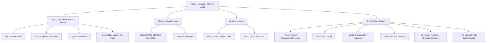

# Rowan Brad Quni-Gudzinas — PQS &amp; Related Theories (Synthesized Gate-Check)

**Source:** Dual AI audit — Claude (`_26205145852.md`) and Gemini (`_26205150012.md`) — 2026-07-24.
**Companion analyses:** [[AI-Comparison-Claude-vs-Gemini-PQS]], [[Physics-Claims-Assessment-PQS-4K]]

---

## Who

**Rowan Brad Quni-Gudzinas** (also publishing as Rowan Brad Quni) is an independent researcher and founder of **QWAV / QNFO**. Publishes on SSRN, ResearchGate, Zenodo, and PhilPapers. Maintains public GitHub repositories (`rwnq8`). Author of *The Information Spectrum* (Eliva Press). No institutional affiliation beyond QWAV/QNFO.

---

## Core Theories (Summary)

### 1. Post-Quantum Synthesis (PQS)

**Thesis:** The universe is fundamentally **continuous, local, and deterministic**. Wavefunction collapse, wave-particle duality, and non-local entanglement are mathematical artifacts arising from discrete measurement interacting with continuous reality.

**Key paper:** &ldquo;Post-Quantum Synthesis: A Complete Framework for Physics&rdquo; (SSRN, 2025-09-23).

**Status per AI audit:** Both Claude and Gemini flag this as **experimentally falsified** by Bell&rsquo;s theorem (1964) and the 2015 loophole-free Bell tests (Hensen, Giustina, Shalm), awarded the 2022 Nobel Prize. No local hidden-variable theory can reproduce quantum correlations. Legitimate deterministic interpretations (Bohmian mechanics) accept explicit non-locality as the price of determinism. PQS claims both locality and determinism without addressing this constraint.

**Physics breakdown:** → [[Physics-Claims-Assessment-PQS-4K#Claim 1 Post-Quantum Synthesis]]

---

### 2. Dimensionless Physics

**Thesis:** Universal constants ($c$, $\hbar$) are not fundamental limits — they are anthropocentric conversion units that vanish when equations are written as pure dimensionless ratios.

**Key paper:** &ldquo;Dimensionless Physics: A Unified Framework&rdquo; (SSRN, 2025-10-14).

**Status per AI audit:** Trivially true but physically empty. Setting $c = \hbar = 1$ (natural units) has been standard practice in theoretical physics since the 1930s. Removing the letters does not remove the physical constraints — the causal structure of spacetime and quantum non-commutativity remain. This is a notational convention, not a physical discovery.

**Physics breakdown:** → [[Physics-Claims-Assessment-PQS-4K#Claim 2 Dimensionless Physics]]

---

### 3. Generative Spiral / Spiral Number Line

**Thesis:** Standard Euclidean geometry is replaced by a logarithmic spiral system grounded in $\pi$ and the golden ratio $\phi$, explaining the 720° rotation required for spin-1/2 particles to return to their original state.

**Key paper:** &ldquo;Generative Spiral: A Geometric Foundation&hellip;&rdquo; (SSRN, 2025-10-31). &ldquo;The Spiral Number Line&rdquo; (SSRN).

**Status per AI audit:** The 720° property is already fully explained by the standard $SU(2) \to SO(3)$ double-covering map (Pauli 1927, Dirac 1928). Standard reference: Sakurai &amp; Napolitano, Modern Quantum Mechanics, Chapter 3. The spiral is a geometric reinterpretation, not a competing explanation — it does not predict anything new or identify any error in standard spinor mathematics.

**Physics breakdown:** → [[Physics-Claims-Assessment-PQS-4K#Claim 3 Generative Spiral]]

---

### 4. 4K Quantum Computing Architecture

**Thesis:** Standard quantum computing hits a strict thermodynamic bottleneck at millikelvin temperatures. &ldquo;Parity-protected&rdquo; qubits operating at 4 Kelvin exploit a ~20,000× increase in cooling power, enabling scalability.

**Key paper:** &ldquo;Why Colder Isn&rsquo;t Better for Quantum Scalability&rdquo; (SSRN, 2026-01-13). Also: &ldquo;Quantum Computation Limits&rdquo; (SSRN).

**Status per AI audit:**

**What&rsquo;s valid:** The cryogenic bottleneck is a real, active engineering frontier. Mainstream groups (UNSW Yang et al. 2020, QuTech Petit et al. 2020, both Nature 580) have demonstrated silicon spin qubits operating at ~1.5 K with single-qubit fidelities >99%. The cooling power jump from μW at 10 mK to W at 1–4 K is physically real.

**What&rsquo;s problematic:**

| Obstacle | Detail |
|:---------|:-------|
| **Aluminum can&rsquo;t superconduct at 4K** | $T_c$(Al) = 1.2 K; 4 K exceeds critical temperature |
| **Niobium quasiparticle poisoning** | $k_BT \approx 83$ GHz vs. $2\Delta$(Nb) ≈ 700 GHz; ~12% of gap thermally available → high quasiparticle population |
| **Nb₂O₅ TLS defects** | Native niobium oxide is a well-documented source of two-level-system decoherence, thermally activated at 4 K |
| **Parity protection sensitivity** | All topological/symmetry protection schemes are acutely sensitive to fabrication disorder — same problem stalling Microsoft&rsquo;s Majorana program |
| **Silicon spin data** | Even at 1.5 K (not 4 K), two-qubit gate fidelity drops to 86%, far below fault-tolerance threshold |

**Physics breakdown:** → [[Physics-Claims-Assessment-PQS-4K#Claim 4 4K Qubit Architecture]]

---

### 5. Neuro-Quantum Biology

**Thesis:** Biological systems may maintain nuclear spin coherence at physiological temperatures via a &ldquo;viscoelastic gating&rdquo; model in microtubules.

**Key paper:** SSRN, 2025.

**Status per AI audit:** Neither Claude nor Gemini engaged this claim in depth. No experimental replication exists. Categorized alongside &ldquo;interdisciplinary synthesis of life, death, and the afterlife&rdquo; as metaphysical/speculative rather than empirically tested.

---

## Cross-Cutting Observations

### Publication Pattern

- All papers are **self-published preprints** on SSRN, ResearchGate, and Zenodo — hosting platforms, not peer review
- One paper is explicitly labeled: &ldquo;Preprints and early-stage research may not have been peer reviewed yet&rdquo; (ResearchGate)
- **High output velocity:** Papers spanning quantum foundations, number theory, qubit thermodynamics, proof-theoretic metaphysics, and an &ldquo;afterlife synthesis&rdquo; — often multiple substantial papers per month
- This pattern (broad scope, high output velocity, self-hosted, no institutional affiliation beyond own entity) is a common signature of independent/fringe theorizing

### What Both AIs Agree On (Convergent Finding)

Despite different architectures and training data, Claude and Gemini independently arrived at:
1. Bell&rsquo;s theorem is the central empirical counter to PQS&rsquo;s core claim
2. Dimensionless physics is trivial, not novel
3. Spiral geometry is redundant with SU(2)/SO(3), not competitive
4. 4K qubit problem is real engineering, but the proposed solution faces hard physical barriers
5. The problems named (foundational weirdness, measurement interpretation, thermal cost) are real; the **specific resolution** (declaring entanglement a measurement artifact) does not survive experimental testing

### Citation Quality Varies by AI

**Claude:** Continuously self-audits (&ldquo;I can&rsquo;t confirm&hellip;&rdquo;, &ldquo;This number doesn&rsquo;t appear in the abstract&hellip;&rdquo;). Flags fake/mismatched citation stubs when present in the conversation.

**Gemini:** Initially produced citation lists mixing legitimate references (APS/PRL, Nature) with social media links (Instagram, Facebook, Reddit). Corrected to vetted academic references only after explicit pushback. Second-round reference list (Bell 1964, Hensen 2015, Tonomura 1989, Arndt 1999, Nielsen &amp; Chuang 2010, Sakurai 2020, Peskin &amp; Schroeder 1995, Yang 2020, Petit 2020) is legitimate and checkable.

---

## Verified Numerics (Common to Both Audit Conversations)

| Quantity | Value | Source / Derivation |
|:---------|:------|:--------------------|
| Al superconducting gap | Δ ≈ 180 μeV | Standard BCS, $T_c \approx 1.2$ K |
| $2\Delta_{\text{Al}}$ (pair-breaking energy) | ~86 GHz | $2 \times 43.5$ GHz |
| $k_B T$ at 4 K | ~83 GHz (~345 μeV) | $k_B \times 4\text{K} / h$ |
| $k_B T$ at 1.5 K | ~31 GHz (~130 μeV) | $k_B \times 1.5\text{K} / h$ |
| Nb $T_c$ | ~9.2 K | Standard BCS |
| $2\Delta$ for Nb | ~700 GHz | $\Delta \approx 1.76 k_B T_c$ |
| Si spin qubit $T_2^*$ at 1.5 K | ~2 μs | Petit et al. (2020), Nature |
| Si spin qubit $T_2$ (echo) at 1.5 K | ~100 μs | Petit et al. (2020) |
| Si spin qubit 1Q fidelity at 1.5 K | >99% | Yang et al. (2020), Nature |
| Si spin qubit 2Q (CROT) fidelity at 1.5 K | ~86% | Yang et al. (2020) — **flagged as unverified by Claude** from abstract alone |

---

## Link Map

---

*Synthesized from two independent AI gate-check conversations on 2026-07-24. See companion analyses for full physics assessment and AI comparison.*
