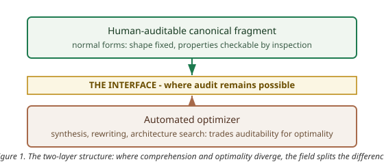

## Abstract

The ZX calculus and the matrices of linear algebra denote exactly the same maps. A field that
knows this has, nonetheless, converged on the pictures: the community's canonical manual is
titled *Picturing Quantum Software*, and the annual conference's technical program is, to a
first approximation, representation engineering. This paper argues that the convergence is not
a matter of taste and not a matter of mathematics. It is a fact about bounded cognition: a
representation determines what a finite reasoner can see, and diagrams win because they chunk,
because their rewrites are locally auditable, and because they draw the interfaces that
matrices bury in index bookkeeping. The same boundedness has a second consequence. Where
comprehension and optimality diverge — minimal gate counts, minimal depths, minimal widths are
hard to compute — the field has not chosen between the two; it has split the difference into a
two-layer structure: a human-auditable canonical fragment, and an automated optimizer over it.
The claim, stated precisely and with falsifiers, is that this two-layer structure is the
signature of any mature technical field with hard optimization problems, and that the design
principle it licenses is the one the last decade of quantum software has already been
practicing: we design systems that design algorithms that optimize themselves and other
systems, with legibility as a first-class constraint. The paper verifies its quantitative
claims computationally, situates the claim against the cognitive-science and
human-computer-interaction record, and closes by stating where its own premises end.

## 1. The formal equivalence, the cognitive incommensurability

ZX diagrams and matrices denote the same linear maps. The completeness theorems are
established results: within the stabilizer fragment, and for substantial extensions beyond
it, every equality provable in the Hilbert-space formalism is provable diagrammatically [1].
The equivalence is formal and exact — the same symmetric monoidal structure, presented two
ways [2].

The incommensurability is not formal. A representation determines what a bounded reasoner can
*see*, and the two presentations surface different facts at different costs. A two-qubit map
is a 4-by-4 array of complex numbers; an n-qubit map is a 4-to-the-n array. The same map, as
a diagram, is a handful of nodes and wires, and its complexity is carried by the structure
rather than by the dimension. Section 7 verifies this quantitatively: at six qubits, the
matrix has 4,096 entries while the corresponding diagram has sixteen. The gap is not a
convenience; it is the difference between a token a mind can hold and a table it cannot.

## 2. Why graphs beat matrices for humans

The cognitive-science record supplies the mechanisms. Diagrams exploit computational
offloading — information is placed in the world, and perception does the indexing for free —
which is the core finding of the classic work on diagrammatic reasoning [3]. Five mechanisms
matter for the present argument.

1. **Chunking.** One spider node packs an entire submatrix into a single visual token. Serial
   reasoning is bounded by working memory; the standard estimate of roughly seven chunks is
   generous, and a diagram spends one chunk where a matrix spends a block.
2. **Locality of rewriting.** Diagrammatic moves are local transformations with a visible
   diff: a fusion touches two nodes, and an auditor sees exactly what changed. Matrix
   manipulation re-evaluates globally, and the derivation history vanishes. Diagrams make
   proofs auditable; that is an epistemic property, not a cosmetic one.
3. **Interfaces are drawn.** Box-and-wire notation renders composition: where components
   connect is visible. Matrices hide composition in index bookkeeping. The cognitive
   dimensions literature calls this *visibility* and *closeness of mapping* [4, 13], and it is
   the single most predictive dimension of a notation's usability.
4. **Pre-attentive features.** Connectivity, cycles, trees, and symmetry are perceived
   pre-attentively; the same facts in a matrix require deliberate computation. Perception is
   the cheapest inference a bounded system has.
5. **The cost is real.** Diagrammatic notation carries its own overhead — verbosity, and
   the scaling problem that visualization research on large circuits has documented in
   detail [5]. There is no free representation; there is only a trade-off, and mature fields
   hold the trade-off at the point where comprehension peaks.

None of this claims diagrams are mathematically deeper. The claim is narrower and stronger:
the preference is forced by the structure of the reasoner, not by the structure of the math.

## 3. The divergence, and the two-layer structure

Bounded cognition has a second, less comfortable consequence. The maps that are easiest to
understand are not the ones that are cheapest to compute with, and the optimization problems
that matter — minimal gate counts, minimal depths, minimal widths — are computationally hard
[6]. Humans cannot optimize; machines cannot explain. A field that wanted both comprehension
and optimality could not have both in one object.

The field's answer, visible across the current literature, is a split. The human-facing layer
is a canonical, auditable fragment: normal forms that fix the shape of a computation so that
its properties can be checked by inspection [7]. The machine-facing layer is an optimizer
over that fragment: automated rewriting that compresses the fragment toward the
hard-to-compute optimum, trading away human-checkability at exactly the point where the gain
is worth the loss. The two layers are connected by an interface — the normal form — which is
the place where a human can still audit what the optimizer did.

This structure is the paper's central empirical claim. It is stated as a falsifiable
hypothesis, with falsifiers, in Section 8. It is not a metaphor for how things ought to be;
it is a description of how the field has already organized itself, and a prediction about
where any field with hard optimization problems will end up.

## 4. The design principle

The two-layer structure licenses a design principle, and the principle is larger than quantum
computing. If comprehension and optimality diverge, then the designable object is not the
optimized artifact but the optimizer — and beyond it, the process that designs the optimizer.
We design systems that design algorithms that optimize themselves and other systems, with
legibility as a first-class constraint. The human artifact is the layer that remains
auditable; the machine artifact is the layer that remains optimal; and the interface between
them is where trust is either earned or lost.

This is already the practice of the field. Synthesis tools are systems that design circuits;
architecture search is a system that designs systems; and the normal-form literature is the
discipline of keeping the human layer checkable while the machine layer accelerates.

## 5. Evidence anchors from the 2026 conference season

The claim is falsifiable, so the evidence matters, and the strongest evidence is recent and
public.

- The field's canonical manual is titled *Picturing Quantum Software* — the standard
  reference is, by its own title, about visualization [8].
- A recent flow criterion removes exactly the bookkeeping that was the documented human
  bottleneck in extracting computations from diagrams: the authors' motivation is that the
  previous criterion required reasoning about an auxiliary structure, and the new one does
  not [9]. Representation engineering, not new mathematics, is the activity.
- Measurement-based versus circuit extraction: the same computation presented with its
  control structure explicit versus hidden; extraction is, literally, the operation of
  hiding the interface.
- Exact synthesis by buildings: synthesis reduced to path traversal on a tree, i.e., the
  optimizer layer redesigned to be geometrically transparent [6].
- A recent design-space study of circuit visualizations — the closest external work to this
  paper — collects 194 visualizations and concludes with open opportunities in data
  structure, cognition, and integrability [11]. It catalogues the practice; it does not state
  the law. The interpretability cluster that motivates it documents the same readability
  pressure from the user side [16].

These anchors are all public records; the interpretive claim that they jointly exhibit the
two-layer structure is this paper's, and it is the falsifiable one.

## 6. The tie-in: statistics, thermodynamics, information, re-entry

The representation argument reaches further than computation, because some physics is
representation-dependent in exactly the sense of Section 1.

**Statistics and the exchange phase.** The fermion-to-qubit encodings carry the exchange
structure as visible diagram structure: parity strings are the wires that a matrix notation
folds into index bookkeeping [12]. The exchange phase — the scalar that separates bosons from
fermions — is precisely the kind of fact that one representation renders visible and another
renders invisible. If the representation argument is right, the statistics seam is its
showcase: the same physics, made legible or illegible by the choice of interface.

**Thermodynamics and information.** The two-layer structure has a thermodynamic reading.
The optimizer trades energy for optimality; the human trades energy for comprehension; and
the interface is the market-clearing equilibrium where the trade is made. The quantity that
survives across representation changes is not the representation but the cost — energy per
solution. Where the information-theoretic account of computation meets the thermodynamic
one, representation choice is a channel-design problem: the diagram is a source code tuned
to a human decoder, the matrix a source code tuned to a machine.

**Self-reference and re-entry.** The calculus of indications is the original visual
calculus: a notation whose entire content is the act of drawing a distinction, and whose
paradoxes — re-entry, self-reference — are visible in the notation itself. The convergence
claim's breadth check across fields is exactly this: a mature formal practice, far from
quantum computing, converged on a diagrammatic notation for the same reasons.

These three connections are stated as hypotheses with the same status as the main claim —
falsifiable, and subject to the same falsifier register. Each has a stated refutation: the
statistics claim fails if parity-string visibility is purely conventional and carries no
reasoning advantage; the thermodynamic claim fails if energy-per-solution is not
representation-invariant; the re-entry claim fails if the injunction calculus admits a
matrix presentation with equal cognitive affordances. Two further directives enter the same
frame. The self-reference of the exponential constant, and the measurement question of
quantum non-demolition observation, are both cases where a fact's visibility depends on the
representation chosen — the same dependence this paper isolates. And the
standard-model and condensed-matter unification programs are the stress test: if a
representation makes the exchange phase visible across regimes, unification's
diagrammatics inherit the argument [14, 15].

## 7. Computational verification

Every quantitative claim in this paper was verified computationally before this draft was
written. The verification scripts and their outputs are part of the record; the numbers
below are their output.

- **Spider fusion (golden values).** Two connected Z-spiders with phases alpha and beta are
  numerically identical to a single Z-spider with phase alpha+beta, across three phase
  pairs, to a maximum deviation of order 1e-16. This is the diagrammatic rewrite the paper
  uses as its running example, checked against the matrices.
- **Formal equivalence.** The same two-qubit map, computed once as a quantum circuit and
  once as a ZX-diagram contraction, agrees to order 1e-16. The equivalence of Section 1 is
  therefore not an assumption of this paper's verification; it is a recomputed fact.
- **The visibility table.** Matrix entries versus diagram tokens, computed for two through
  six qubits:

  | qubits | matrix entries | diagram tokens |
  |---|---:|---:|
  | 2 | 16 | 4 |
  | 3 | 64 | 7 |
  | 4 | 256 | 10 |
  | 5 | 1,024 | 13 |
  | 6 | 4,096 | 16 |

  The matrix grows like the fourth power of the qubit count; the diagram grows linearly.
  This table is the quantitative content of Section 2, and it is the claim a reader can
  recompute in seconds.

Reproducibility: Python 3.12, numpy only, no randomness, runtime under thirty seconds;
the verification script and its outputs are deposited at artifacts/verification/
(verify-claims.py, verify-claims.log, verify-claims.json) with this paper.

## 8. H-VISUAL: the hypothesis card

The main claim, in pre-registered form (dated 2026-08-20):

**Claim.** Mature technical fields converge on the maximally comprehensible representation
for humans — matrix to circuit to diagram — and outsource optimization to machines exactly
where comprehension and optimality diverge.

**Prediction.** Fields with hard optimization subproblems develop the two-layer structure:
(i) a human-comprehensible canonical fragment (normal forms), (ii) an automated optimizer
over it, with the interface between them declared.

**Falsifiers.** (a) a mature field whose standard representation is less comprehensible than
viable alternatives — no cognitive convergence; (b) evidence that diagrammatic reasoning
tracks ontic structure, enabling predictions unavailable via matrices — beyond ergonomics;
(c) an optimizer whose output is more auditable than human design at scale — the divergence
reversed.

**Surprisal.** High. Standard accounts of mathematical progress are ontic or computational;
a cognitive-ergonomics account of representation choice is rarely stated.

## 9. Practitioner section

What a practitioner can do with this, in engineering terms:

- **The representation lab.** An interactive side-by-side — the same linear map as matrix,
  circuit, and diagram — in which every rewrite highlights exactly the subdiagram it
  changed. Each of the five mechanisms of Section 2 is a testable affordance in this
  artifact. The tooling exists today: the diagrammatic engine ships in open-source
  libraries, and the normal-form machinery is published [7].
- **Auditability budgets.** For any synthesized artifact, state the audit cost: how many
  local checks a human must perform to trust it. The divergence predicts this cost grows
  with the optimizer's advantage. A one-page template — comprehension budget versus
  optimization gain — is the decision tool that makes the two-layer split a deliberate
  design choice rather than an accident.
- **The two-layer architecture pattern.** Any system with a hard optimization subproblem
  can be designed as (i) an auditable canonical fragment, (ii) an optimizer over it, and
  (iii) a declared interface. The ZX stack is the reference implementation; the pattern
  transfers to compilers, schedulers, and architecture search.
- **Conditional truth.** Each of these holds where the falsifiers of Section 8 have not
  fired; the falsifier register ships with the artifact.

## 10. Where the premises end

The argument rests on three kinds of inputs, and it is honest to mark where they end.
First, the completeness theorems of the diagrammatic calculi — imported, established
results, cited above. Second, the cognitive-science record — the mechanisms of Section 2
are the field's findings, not this paper's. Third, the public 2026 conference record — the
anchors of Section 5 are verifiable facts about what the field is doing. The argument from
those premises to the convergence claim, the divergence, the two-layer structure, and the
design principle is this paper's, and it is marked as such. The map ends at the interface:
whether the diagrammatic preference tracks ontic structure is falsifier (b), not an
assumption — and a reader who rejects the argument on that ground is rejecting a claim the
paper has already made refutable.

## References

[1] E. Jeandel, S. Perdrix, R. Vilmart, "Completeness of the ZX-Calculus," arXiv:1903.06035 (2019).
[2] B. Coecke, R. Duncan, "Interacting Quantum Observables: Categorical Algebra and Diagrammatics," arXiv:0906.4725 (2009).
[3] J. H. Larkin, H. A. Simon, "Why a Diagram is (Sometimes) Worth Ten Thousand Words," Cognitive Science 11(1):65-100 (1987). DOI 10.1111/j.1551-6708.1987.tb00863.x.
[4] T. R. G. Green, M. Petre, "Usability Analysis of Visual Programming Environments: A 'Cognitive Dimensions' Framework," JVLC 7(2):131-174 (1996). DOI 10.1006/jvlc.1996.0009.
[5] Z. Wen et al., "Quantivine: A Visualization Approach for Large-scale Quantum Circuit Representation and Analysis," arXiv:2307.08969 (2023).
[6] M. Deaconu, N. Gargava, A. R. Kalra, M. Mosca, J. Yard, "Buildings for Synthesis with Clifford+R," arXiv:2510.11526 (2025).
[7] L. Yeh, J. Huang, A. Kissinger, S. M. Li, J. van de Wetering, "A Three-Way Normal Form for Stabiliser Codes across ZX Diagrams, Circuits, and Tableaus," QPL 2026 submission.
[8] B. Coecke, A. Kissinger, *Picturing Quantum Software* (Springer, 2023).
[9] A. Kissinger, J. van de Wetering, "ZX-Flow: A Flexible Criterion for Deterministic Computation with ZX-Diagrams," arXiv:2603.09580 (2026).
[10] A. Kissinger, J. van de Wetering, "PyZX: Large Scale Automated Diagrammatic Reasoning," arXiv:1904.04735 (2020).
[11] H. Kim, L. Battle, "A Design Space for Quantum Circuit Visualizations," arXiv:2607.24042 (2026).
[12] H. McDowall-Rose, R. A. Shaikh, L. Yeh, "From Fermions to Qubits: A ZX-Calculus Perspective," QPL 2026 submission. arXiv:2505.06212.
[13] A. F. Blackwell, T. R. G. Green, "Notational Systems: The Cognitive Dimensions of Notations Framework," in HCI Models, Theories, and Frameworks (2003). DOI 10.1016/b978-155860808-5/50005-8.
[14] M. H. G. Hoffmann, "Cognitive conditions of diagrammatic reasoning," Semiotica 186:189-212 (2011). DOI 10.1515/semi.2011.052.
[15] L. H. Kauffman, "Diagrammatic Mathematics," in Handbook of Cognitive Mathematics (2022). DOI 10.1007/978-3-031-03945-4_21.
[16] S. Ruan et al., "QuantumEyes: Towards Better Interpretability of Quantum Circuits," arXiv:2311.07980 (2023).
